# 1. Importing Libraries & Packages :rocket:


```python
import pandas as pd
import matplotlib.pyplot as plt
import seaborn as sb
from prophet import Prophet
```

# 2. Data Preview :chart_with_downwards_trend:
### Let's start by loading the dataset and exploring the first few rows.

```python
df=pd.read_csv('dataset.csv')
df.head()
```

    C:\Users\gurma\AppData\Local\Temp/ipykernel_14324/873425855.py:1: DtypeWarning: Columns (7) have mixed types. Specify dtype option on import or set low_memory=False.
      df=pd.read_csv('dataset.csv')
    


<div>
<style scoped>
    .dataframe tbody tr th:only-of-type {
        vertical-align: middle;
    }

    .dataframe tbody tr th {
        vertical-align: top;
    }

    .dataframe thead th {
        text-align: right;
    }
</style>
<table border="1" class="dataframe">
  <thead>
    <tr style="text-align: right;">
      <th></th>
      <th>Store</th>
      <th>DayOfWeek</th>
      <th>Date</th>
      <th>Sales</th>
      <th>Customers</th>
      <th>Open</th>
      <th>Promo</th>
      <th>StateHoliday</th>
      <th>SchoolHoliday</th>
    </tr>
  </thead>
  <tbody>
    <tr>
      <th>0</th>
      <td>1</td>
      <td>5</td>
      <td>2015-07-31</td>
      <td>5263</td>
      <td>555</td>
      <td>1</td>
      <td>1</td>
      <td>0</td>
      <td>1</td>
    </tr>
    <tr>
      <th>1</th>
      <td>2</td>
      <td>5</td>
      <td>2015-07-31</td>
      <td>6064</td>
      <td>625</td>
      <td>1</td>
      <td>1</td>
      <td>0</td>
      <td>1</td>
    </tr>
    <tr>
      <th>2</th>
      <td>3</td>
      <td>5</td>
      <td>2015-07-31</td>
      <td>8314</td>
      <td>821</td>
      <td>1</td>
      <td>1</td>
      <td>0</td>
      <td>1</td>
    </tr>
    <tr>
      <th>3</th>
      <td>4</td>
      <td>5</td>
      <td>2015-07-31</td>
      <td>13995</td>
      <td>1498</td>
      <td>1</td>
      <td>1</td>
      <td>0</td>
      <td>1</td>
    </tr>
    <tr>
      <th>4</th>
      <td>5</td>
      <td>5</td>
      <td>2015-07-31</td>
      <td>4822</td>
      <td>559</td>
      <td>1</td>
      <td>1</td>
      <td>0</td>
      <td>1</td>
    </tr>
  </tbody>
</table>
</div>


### 2.1 Dataset exploration :mag_right:

#### Next, let's get an overview of the dataset, check for any null values, and examine the data types.


```python
df.info()
```

    <class 'pandas.core.frame.DataFrame'>
    RangeIndex: 1017209 entries, 0 to 1017208
    Data columns (total 9 columns):
     #   Column         Non-Null Count    Dtype 
    ---  ------         --------------    ----- 
     0   Store          1017209 non-null  int64 
     1   DayOfWeek      1017209 non-null  int64 
     2   Date           1017209 non-null  object
     3   Sales          1017209 non-null  int64 
     4   Customers      1017209 non-null  int64 
     5   Open           1017209 non-null  int64 
     6   Promo          1017209 non-null  int64 
     7   StateHoliday   1017209 non-null  object
     8   SchoolHoliday  1017209 non-null  int64 
    dtypes: int64(7), object(2)
    memory usage: 69.8+ MB
    


```python
df.isnull().sum()
```


    Store            0
    DayOfWeek        0
    Date             0
    Sales            0
    Customers        0
    Open             0
    Promo            0
    StateHoliday     0
    SchoolHoliday    0
    dtype: int64


*No null values*

### 2.2 Summary Statistics :bar_chart:

#### Now, we'll look into the summary statistics of the numerical columns in the dataset.

```python
df.describe().transpose()
```


<div>
<style scoped>
    .dataframe tbody tr th:only-of-type {
        vertical-align: middle;
    }

    .dataframe tbody tr th {
        vertical-align: top;
    }

    .dataframe thead th {
        text-align: right;
    }
</style>
<table border="1" class="dataframe">
  <thead>
    <tr style="text-align: right;">
      <th></th>
      <th>count</th>
      <th>mean</th>
      <th>std</th>
      <th>min</th>
      <th>25%</th>
      <th>50%</th>
      <th>75%</th>
      <th>max</th>
    </tr>
  </thead>
  <tbody>
    <tr>
      <th>Store</th>
      <td>1017209.0</td>
      <td>558.429727</td>
      <td>321.908651</td>
      <td>1.0</td>
      <td>280.0</td>
      <td>558.0</td>
      <td>838.0</td>
      <td>1115.0</td>
    </tr>
    <tr>
      <th>DayOfWeek</th>
      <td>1017209.0</td>
      <td>3.998341</td>
      <td>1.997391</td>
      <td>1.0</td>
      <td>2.0</td>
      <td>4.0</td>
      <td>6.0</td>
      <td>7.0</td>
    </tr>
    <tr>
      <th>Sales</th>
      <td>1017209.0</td>
      <td>5773.818972</td>
      <td>3849.926175</td>
      <td>0.0</td>
      <td>3727.0</td>
      <td>5744.0</td>
      <td>7856.0</td>
      <td>41551.0</td>
    </tr>
    <tr>
      <th>Customers</th>
      <td>1017209.0</td>
      <td>633.145946</td>
      <td>464.411734</td>
      <td>0.0</td>
      <td>405.0</td>
      <td>609.0</td>
      <td>837.0</td>
      <td>7388.0</td>
    </tr>
    <tr>
      <th>Open</th>
      <td>1017209.0</td>
      <td>0.830107</td>
      <td>0.375539</td>
      <td>0.0</td>
      <td>1.0</td>
      <td>1.0</td>
      <td>1.0</td>
      <td>1.0</td>
    </tr>
    <tr>
      <th>Promo</th>
      <td>1017209.0</td>
      <td>0.381515</td>
      <td>0.485759</td>
      <td>0.0</td>
      <td>0.0</td>
      <td>0.0</td>
      <td>1.0</td>
      <td>1.0</td>
    </tr>
    <tr>
      <th>SchoolHoliday</th>
      <td>1017209.0</td>
      <td>0.178647</td>
      <td>0.383056</td>
      <td>0.0</td>
      <td>0.0</td>
      <td>0.0</td>
      <td>0.0</td>
      <td>1.0</td>
    </tr>
  </tbody>
</table>
</div>


```python
df.columns
```


    Index(['Store', 'DayOfWeek', 'Date', 'Sales', 'Customers', 'Open', 'Promo',
           'StateHoliday', 'SchoolHoliday'],
          dtype='object')


# 3. Feature Extraction :calendar:

### Let's extract useful features like year, month, date, and weekday from the 'Date' column.


```python
df['Year'] = pd.to_datetime(df['Date']).dt.year
```


```python
df['Month'] = pd.to_datetime(df['Date']).dt.month
```


```python
df.head()
```


<div>
<style scoped>
    .dataframe tbody tr th:only-of-type {
        vertical-align: middle;
    }

    .dataframe tbody tr th {
        vertical-align: top;
    }

    .dataframe thead th {
        text-align: right;
    }
</style>
<table border="1" class="dataframe">
  <thead>
    <tr style="text-align: right;">
      <th></th>
      <th>Store</th>
      <th>DayOfWeek</th>
      <th>Date</th>
      <th>Sales</th>
      <th>Customers</th>
      <th>Open</th>
      <th>Promo</th>
      <th>StateHoliday</th>
      <th>SchoolHoliday</th>
      <th>Year</th>
      <th>Month</th>
    </tr>
  </thead>
  <tbody>
    <tr>
      <th>0</th>
      <td>1</td>
      <td>5</td>
      <td>2015-07-31</td>
      <td>5263</td>
      <td>555</td>
      <td>1</td>
      <td>1</td>
      <td>0</td>
      <td>1</td>
      <td>2015</td>
      <td>7</td>
    </tr>
    <tr>
      <th>1</th>
      <td>2</td>
      <td>5</td>
      <td>2015-07-31</td>
      <td>6064</td>
      <td>625</td>
      <td>1</td>
      <td>1</td>
      <td>0</td>
      <td>1</td>
      <td>2015</td>
      <td>7</td>
    </tr>
    <tr>
      <th>2</th>
      <td>3</td>
      <td>5</td>
      <td>2015-07-31</td>
      <td>8314</td>
      <td>821</td>
      <td>1</td>
      <td>1</td>
      <td>0</td>
      <td>1</td>
      <td>2015</td>
      <td>7</td>
    </tr>
    <tr>
      <th>3</th>
      <td>4</td>
      <td>5</td>
      <td>2015-07-31</td>
      <td>13995</td>
      <td>1498</td>
      <td>1</td>
      <td>1</td>
      <td>0</td>
      <td>1</td>
      <td>2015</td>
      <td>7</td>
    </tr>
    <tr>
      <th>4</th>
      <td>5</td>
      <td>5</td>
      <td>2015-07-31</td>
      <td>4822</td>
      <td>559</td>
      <td>1</td>
      <td>1</td>
      <td>0</td>
      <td>1</td>
      <td>2015</td>
      <td>7</td>
    </tr>
  </tbody>
</table>
</div>


```python
df['Day'] = pd.to_datetime(df['Date']).dt.day
```


```python
df['Weekday'] = pd.to_datetime(df['Date']).dt.strftime('%A')
```


```python
df.head()
```


<div>
<style scoped>
    .dataframe tbody tr th:only-of-type {
        vertical-align: middle;
    }

    .dataframe tbody tr th {
        vertical-align: top;
    }

    .dataframe thead th {
        text-align: right;
    }
</style>
<table border="1" class="dataframe">
  <thead>
    <tr style="text-align: right;">
      <th></th>
      <th>Store</th>
      <th>DayOfWeek</th>
      <th>Date</th>
      <th>Sales</th>
      <th>Customers</th>
      <th>Open</th>
      <th>Promo</th>
      <th>StateHoliday</th>
      <th>SchoolHoliday</th>
      <th>Year</th>
      <th>Month</th>
      <th>Day</th>
      <th>Weekday</th>
    </tr>
  </thead>
  <tbody>
    <tr>
      <th>0</th>
      <td>1</td>
      <td>5</td>
      <td>2015-07-31</td>
      <td>5263</td>
      <td>555</td>
      <td>1</td>
      <td>1</td>
      <td>0</td>
      <td>1</td>
      <td>2015</td>
      <td>7</td>
      <td>31</td>
      <td>Friday</td>
    </tr>
    <tr>
      <th>1</th>
      <td>2</td>
      <td>5</td>
      <td>2015-07-31</td>
      <td>6064</td>
      <td>625</td>
      <td>1</td>
      <td>1</td>
      <td>0</td>
      <td>1</td>
      <td>2015</td>
      <td>7</td>
      <td>31</td>
      <td>Friday</td>
    </tr>
    <tr>
      <th>2</th>
      <td>3</td>
      <td>5</td>
      <td>2015-07-31</td>
      <td>8314</td>
      <td>821</td>
      <td>1</td>
      <td>1</td>
      <td>0</td>
      <td>1</td>
      <td>2015</td>
      <td>7</td>
      <td>31</td>
      <td>Friday</td>
    </tr>
    <tr>
      <th>3</th>
      <td>4</td>
      <td>5</td>
      <td>2015-07-31</td>
      <td>13995</td>
      <td>1498</td>
      <td>1</td>
      <td>1</td>
      <td>0</td>
      <td>1</td>
      <td>2015</td>
      <td>7</td>
      <td>31</td>
      <td>Friday</td>
    </tr>
    <tr>
      <th>4</th>
      <td>5</td>
      <td>5</td>
      <td>2015-07-31</td>
      <td>4822</td>
      <td>559</td>
      <td>1</td>
      <td>1</td>
      <td>0</td>
      <td>1</td>
      <td>2015</td>
      <td>7</td>
      <td>31</td>
      <td>Friday</td>
    </tr>
  </tbody>
</table>
</div>


# 4. Exploratory Data Analysis (EDA) :bar_chart:

## Now, let's explore the data visually and gain insights from various visualizations.

### 4.1 Weekday Sales Analysis :calendar:

```python
df.groupby('Weekday')[['Sales']].mean().sort_index().plot(figsize=(10,5), marker= '^', color = 'blue')
```


    <Axes: xlabel='Weekday'>


    
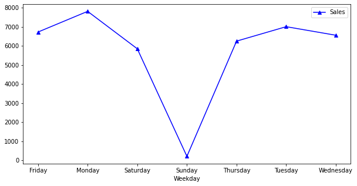
    


*4.1 Clearly, the sales drop on Sundays and are maximum on Mondays and Tuesday*

### 4.2 Yearly Sales Trend :chart_with_upwards_trend:
```python
df.groupby('Year')[['Sales']].mean().sort_index().plot(figsize=(10,5), marker = '.', color= 'red')
```


    <Axes: xlabel='Year'>


    
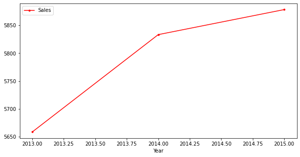
    


*4.2 There is a linear trend of increase in the sales from 2013 to 2015*

### 4.3 Monthly Sales Trend :bar_chart:
```python
monthly_sales  = df.groupby('Month')[['Sales']].mean()

plt.figure(figsize=(10,5))

sb.lineplot(x= monthly_sales.index, y ='Sales',data = monthly_sales, marker = '*' ,markersize=10, markerfacecolor='red', color='blue')

plt.title('Average Monthly Sales')
plt.show()
```


    
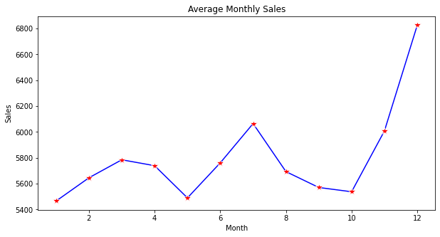
    


*4.3 The average monthly sales suggests that the sales are maximum in December followed by July and November and least in January*

### 4.4 Sales Distribution :chart_with_histogram:
```python
df.Sales.plot(figsize=(10,5), kind = 'hist')
```


    <Axes: ylabel='Frequency'>


    
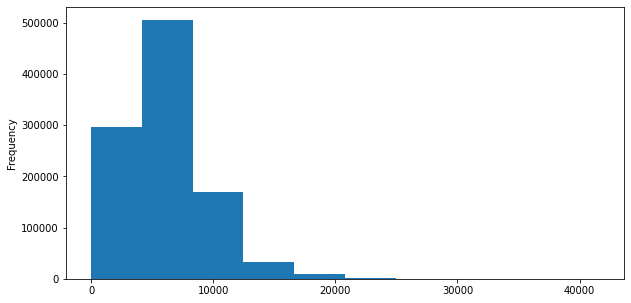
    


*4.4 Checking the distribution of data in the Sales columns. The above graph suggests the data is skewed. It will be kept in mind during the model training*

### 4.5 Stores with Maximum Sales :department_store:
```python
df.groupby('Store')[['Sales']].max().plot(figsize=(10,5), marker = '^', color= 'red')
```


    <Axes: xlabel='Store'>


    
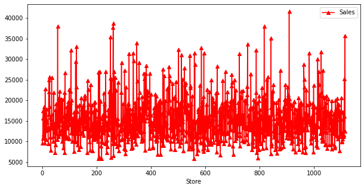
    


*4.5 Maximum sales with respect to store. The above graph is showing all the stores. let's filter it out in the next graph to get a clear picture*

### 4.6 Top 10 Stores with Maximum Sales :bar_chart:
```python
stores_with_max_sales = df.groupby('Store')[['Sales']].max()
top_10_largest_stores = stores_with_max_sales.nlargest(10, 'Sales')

plt.figure(figsize = (10,5))

sb.barplot(x= top_10_largest_stores.index , y = 'Sales', data  = top_10_largest_stores)
```


    <Axes: xlabel='Store', ylabel='Sales'>


    
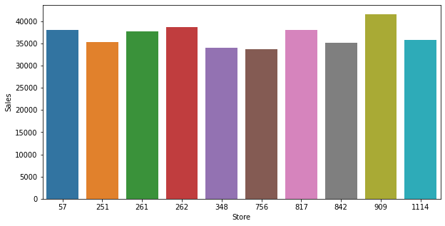
    


*4.6 Top 10 stores having the maximum no. of Sales*

### 4.7 Top 5 Stores with Maximum Customers :bar_chart:
```python
store_customer = df.groupby('Store')[['Customers']].mean()
top_5_largest = store_customer.nlargest(5, 'Customers')

plt.figure(figsize = (10,5))
sb.barplot(x= top_5_largest.index , y = 'Customers', data  = top_5_largest)

```


    <Axes: xlabel='Store', ylabel='Customers'>


    
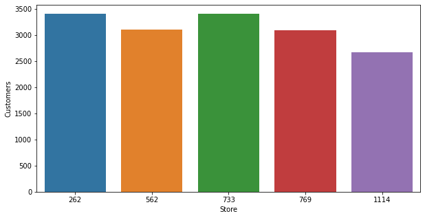
    


*4.7 Top 5 stores having the maximum no. of customers*


```python
df.columns
```


    Index(['Store', 'DayOfWeek', 'Date', 'Sales', 'Customers', 'Open', 'Promo',
           'StateHoliday', 'SchoolHoliday', 'Year', 'Month', 'Day', 'Weekday'],
          dtype='object')


### 4.8 Average Daily Sales :chart_with_upwards_trend:
```python
daily_sales = df.groupby('Day')[['Sales']].mean()
plt.figure(figsize = (10,5))
sb.lineplot( x = daily_sales.index , y = 'Sales', data = daily_sales, marker = '*', markersize= 8, markerfacecolor = 'purple')
```


    <Axes: xlabel='Day', ylabel='Sales'>


    
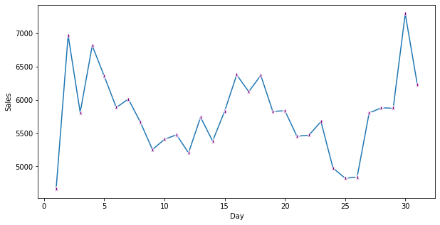
    


*4.8 Average Daily Sales*

### 4.9 Sales on Weekdays with/without Promo :bar_chart:
```python
plt.figure(figsize = (10,5))
sb.barplot(x= df['Weekday'] , y = df['Sales'] , data = df, hue= 'Promo')
```


    <Axes: xlabel='Weekday', ylabel='Sales'>


    
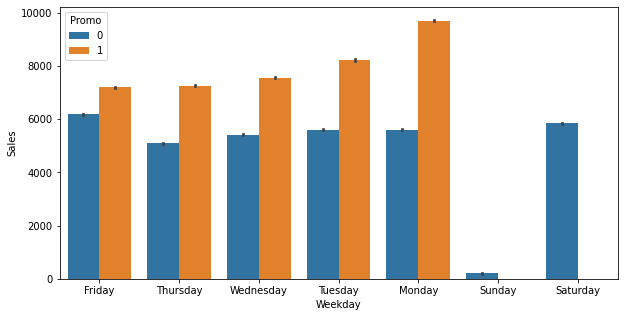
    


*4.9 Effect of Promo code on the sales on weekdays*

### 4.10 Customer Relation based on Month :chart_with_upwards_trend:
```python
customer_monthly = df.groupby('Month')[['Customers']].mean()
plt.figure(figsize = (10,5))

sb.lineplot(x= customer_monthly.index , y = 'Customers', data  = customer_monthly, marker = '^', markersize = 8, markerfacecolor = 'green')

```


    <Axes: xlabel='Month', ylabel='Customers'>


    
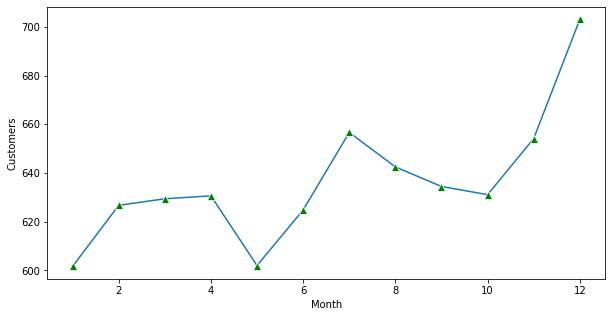
    


*4.10 Relation of customers on the basis of month*

# 5. Time-Series Analysis

## Now, let's perform time-series analysis using the awesome Prophet library!

### 5.1 Selecting a Store for Forecasting :crystal_ball:

In Order to do our analysis & forecasting let's first select a store having  maximum no. of average sales.


```python
df.groupby('Store')[['Sales']].mean().nlargest(1,columns = 'Sales')
```


<div>
<style scoped>
    .dataframe tbody tr th:only-of-type {
        vertical-align: middle;
    }

    .dataframe tbody tr th {
        vertical-align: top;
    }

    .dataframe thead th {
        text-align: right;
    }
</style>
<table border="1" class="dataframe">
  <thead>
    <tr style="text-align: right;">
      <th></th>
      <th>Sales</th>
    </tr>
    <tr>
      <th>Store</th>
      <th></th>
    </tr>
  </thead>
  <tbody>
    <tr>
      <th>262</th>
      <td>20718.515924</td>
    </tr>
  </tbody>
</table>
</div>


So store no. 262 have the maximum no. of average sales. let's choose this store for further analysis


```python
df.head()
```


<div>
<style scoped>
    .dataframe tbody tr th:only-of-type {
        vertical-align: middle;
    }

    .dataframe tbody tr th {
        vertical-align: top;
    }

    .dataframe thead th {
        text-align: right;
    }
</style>
<table border="1" class="dataframe">
  <thead>
    <tr style="text-align: right;">
      <th></th>
      <th>Store</th>
      <th>DayOfWeek</th>
      <th>Date</th>
      <th>Sales</th>
      <th>Customers</th>
      <th>Open</th>
      <th>Promo</th>
      <th>StateHoliday</th>
      <th>SchoolHoliday</th>
      <th>Year</th>
      <th>Month</th>
      <th>Day</th>
      <th>Weekday</th>
    </tr>
  </thead>
  <tbody>
    <tr>
      <th>0</th>
      <td>1</td>
      <td>5</td>
      <td>2015-07-31</td>
      <td>5263</td>
      <td>555</td>
      <td>1</td>
      <td>1</td>
      <td>0</td>
      <td>1</td>
      <td>2015</td>
      <td>7</td>
      <td>31</td>
      <td>Friday</td>
    </tr>
    <tr>
      <th>1</th>
      <td>2</td>
      <td>5</td>
      <td>2015-07-31</td>
      <td>6064</td>
      <td>625</td>
      <td>1</td>
      <td>1</td>
      <td>0</td>
      <td>1</td>
      <td>2015</td>
      <td>7</td>
      <td>31</td>
      <td>Friday</td>
    </tr>
    <tr>
      <th>2</th>
      <td>3</td>
      <td>5</td>
      <td>2015-07-31</td>
      <td>8314</td>
      <td>821</td>
      <td>1</td>
      <td>1</td>
      <td>0</td>
      <td>1</td>
      <td>2015</td>
      <td>7</td>
      <td>31</td>
      <td>Friday</td>
    </tr>
    <tr>
      <th>3</th>
      <td>4</td>
      <td>5</td>
      <td>2015-07-31</td>
      <td>13995</td>
      <td>1498</td>
      <td>1</td>
      <td>1</td>
      <td>0</td>
      <td>1</td>
      <td>2015</td>
      <td>7</td>
      <td>31</td>
      <td>Friday</td>
    </tr>
    <tr>
      <th>4</th>
      <td>5</td>
      <td>5</td>
      <td>2015-07-31</td>
      <td>4822</td>
      <td>559</td>
      <td>1</td>
      <td>1</td>
      <td>0</td>
      <td>1</td>
      <td>2015</td>
      <td>7</td>
      <td>31</td>
      <td>Friday</td>
    </tr>
  </tbody>
</table>
</div>


```python
new_df = df[['Date','Sales','Store']].copy()
new_df.head()
```


<div>
<style scoped>
    .dataframe tbody tr th:only-of-type {
        vertical-align: middle;
    }

    .dataframe tbody tr th {
        vertical-align: top;
    }

    .dataframe thead th {
        text-align: right;
    }
</style>
<table border="1" class="dataframe">
  <thead>
    <tr style="text-align: right;">
      <th></th>
      <th>Date</th>
      <th>Sales</th>
      <th>Store</th>
    </tr>
  </thead>
  <tbody>
    <tr>
      <th>0</th>
      <td>2015-07-31</td>
      <td>5263</td>
      <td>1</td>
    </tr>
    <tr>
      <th>1</th>
      <td>2015-07-31</td>
      <td>6064</td>
      <td>2</td>
    </tr>
    <tr>
      <th>2</th>
      <td>2015-07-31</td>
      <td>8314</td>
      <td>3</td>
    </tr>
    <tr>
      <th>3</th>
      <td>2015-07-31</td>
      <td>13995</td>
      <td>4</td>
    </tr>
    <tr>
      <th>4</th>
      <td>2015-07-31</td>
      <td>4822</td>
      <td>5</td>
    </tr>
  </tbody>
</table>
</div>


```python
new_df= new_df[new_df['Store']==262].loc[:,:]
```


```python
new_df.head()
```


<div>
<style scoped>
    .dataframe tbody tr th:only-of-type {
        vertical-align: middle;
    }

    .dataframe tbody tr th {
        vertical-align: top;
    }

    .dataframe thead th {
        text-align: right;
    }
</style>
<table border="1" class="dataframe">
  <thead>
    <tr style="text-align: right;">
      <th></th>
      <th>Date</th>
      <th>Sales</th>
      <th>Store</th>
    </tr>
  </thead>
  <tbody>
    <tr>
      <th>261</th>
      <td>2015-07-31</td>
      <td>25774</td>
      <td>262</td>
    </tr>
    <tr>
      <th>1376</th>
      <td>2015-07-30</td>
      <td>22253</td>
      <td>262</td>
    </tr>
    <tr>
      <th>2491</th>
      <td>2015-07-29</td>
      <td>21041</td>
      <td>262</td>
    </tr>
    <tr>
      <th>3606</th>
      <td>2015-07-28</td>
      <td>22442</td>
      <td>262</td>
    </tr>
    <tr>
      <th>4721</th>
      <td>2015-07-27</td>
      <td>22185</td>
      <td>262</td>
    </tr>
  </tbody>
</table>
</div>


```python
new_df.shape
```


    (942, 3)


## 5.2 In Order to use prophet , we want the dataframe in a specific format


```python
prophet_df= new_df[['Date','Sales']].copy()
```


```python
# Rename the columns to 'ds' and 'y'
prophet_df = prophet_df.rename(columns={'Date': 'ds', 'Sales': 'y'})
```

#### Let's sort the dataframe by date time stamp


```python
prophet_df.sort_values('ds',inplace= True)
prophet_df.head()
```


<div>
<style scoped>
    .dataframe tbody tr th:only-of-type {
        vertical-align: middle;
    }

    .dataframe tbody tr th {
        vertical-align: top;
    }

    .dataframe thead th {
        text-align: right;
    }
</style>
<table border="1" class="dataframe">
  <thead>
    <tr style="text-align: right;">
      <th></th>
      <th>ds</th>
      <th>y</th>
    </tr>
  </thead>
  <tbody>
    <tr>
      <th>1016356</th>
      <td>2013-01-01</td>
      <td>17267</td>
    </tr>
    <tr>
      <th>1015241</th>
      <td>2013-01-02</td>
      <td>16964</td>
    </tr>
    <tr>
      <th>1014126</th>
      <td>2013-01-03</td>
      <td>16616</td>
    </tr>
    <tr>
      <th>1013011</th>
      <td>2013-01-04</td>
      <td>16849</td>
    </tr>
    <tr>
      <th>1011896</th>
      <td>2013-01-05</td>
      <td>14868</td>
    </tr>
  </tbody>
</table>
</div>


## 5.3 Initializing and Training the Model :zap:


```python
model = Prophet()
```


```python
model.fit(prophet_df)
```

    12:25:24 - cmdstanpy - INFO - Chain [1] start processing
    12:25:25 - cmdstanpy - INFO - Chain [1] done processing
    


    <prophet.forecaster.Prophet at 0x2aacfb01eb0>


## 5.3 Creating Future Dates for Forecasting :calendar:

As our model is now trained on the dataset, let's prepare some new dates for forecasting our trained model's predictions.
Prophet has the functionality to generate future datestamps as a dataframe. Further this dataframe will be used to predict the sales by our trained model


```python
new_df = model.make_future_dataframe(periods = 42 , freq = 'W')
```


```python
new_df.head()
```


<div>
<style scoped>
    .dataframe tbody tr th:only-of-type {
        vertical-align: middle;
    }

    .dataframe tbody tr th {
        vertical-align: top;
    }

    .dataframe thead th {
        text-align: right;
    }
</style>
<table border="1" class="dataframe">
  <thead>
    <tr style="text-align: right;">
      <th></th>
      <th>ds</th>
    </tr>
  </thead>
  <tbody>
    <tr>
      <th>0</th>
      <td>2013-01-01</td>
    </tr>
    <tr>
      <th>1</th>
      <td>2013-01-02</td>
    </tr>
    <tr>
      <th>2</th>
      <td>2013-01-03</td>
    </tr>
    <tr>
      <th>3</th>
      <td>2013-01-04</td>
    </tr>
    <tr>
      <th>4</th>
      <td>2013-01-05</td>
    </tr>
  </tbody>
</table>
</div>


```python
new_df.shape
```


    (984, 1)


Therefore, 42 weeks of date stamps is ready in a dateframe to be fed to the trained model.

## 5.4 Predictions and Outcomes:crystal_ball:


```python
forecast = model.predict(new_df)

```


```python
forecast[['ds','yhat_lower', 'yhat_upper', 'yhat']]
```


<div>
<style scoped>
    .dataframe tbody tr th:only-of-type {
        vertical-align: middle;
    }

    .dataframe tbody tr th {
        vertical-align: top;
    }

    .dataframe thead th {
        text-align: right;
    }
</style>
<table border="1" class="dataframe">
  <thead>
    <tr style="text-align: right;">
      <th></th>
      <th>ds</th>
      <th>yhat_lower</th>
      <th>yhat_upper</th>
      <th>yhat</th>
    </tr>
  </thead>
  <tbody>
    <tr>
      <th>0</th>
      <td>2013-01-01</td>
      <td>15496.670043</td>
      <td>22604.573775</td>
      <td>18979.235904</td>
    </tr>
    <tr>
      <th>1</th>
      <td>2013-01-02</td>
      <td>15035.282009</td>
      <td>22258.568602</td>
      <td>18487.892313</td>
    </tr>
    <tr>
      <th>2</th>
      <td>2013-01-03</td>
      <td>15445.904010</td>
      <td>22506.348625</td>
      <td>19103.413565</td>
    </tr>
    <tr>
      <th>3</th>
      <td>2013-01-04</td>
      <td>16634.419354</td>
      <td>23950.523917</td>
      <td>20281.288929</td>
    </tr>
    <tr>
      <th>4</th>
      <td>2013-01-05</td>
      <td>12810.320147</td>
      <td>19705.781615</td>
      <td>16254.423176</td>
    </tr>
    <tr>
      <th>...</th>
      <td>...</td>
      <td>...</td>
      <td>...</td>
      <td>...</td>
    </tr>
    <tr>
      <th>979</th>
      <td>2016-04-17</td>
      <td>25427.500413</td>
      <td>33422.618692</td>
      <td>29554.945723</td>
    </tr>
    <tr>
      <th>980</th>
      <td>2016-04-24</td>
      <td>26048.937438</td>
      <td>33378.539410</td>
      <td>29665.271918</td>
    </tr>
    <tr>
      <th>981</th>
      <td>2016-05-01</td>
      <td>26437.422289</td>
      <td>33962.571474</td>
      <td>30265.104945</td>
    </tr>
    <tr>
      <th>982</th>
      <td>2016-05-08</td>
      <td>27244.311965</td>
      <td>34659.574492</td>
      <td>30901.256380</td>
    </tr>
    <tr>
      <th>983</th>
      <td>2016-05-15</td>
      <td>27020.368527</td>
      <td>34917.357141</td>
      <td>31026.668257</td>
    </tr>
  </tbody>
</table>
<p>984 rows × 4 columns</p>
</div>


There are 4 outputs that are important to explain. These outputs are:

#### ds: *the datestamp of the forecasted value*

#### yhat: *the forecasted value of our metric*

#### yhat_lower: *the lower bound of our forecasts*

#### yhat_upper: *the upper bound of our forecasts*

# 6. Plotting the forecast :chart_with_upwards_trend:


```python
fig1= model.plot(forecast, xlabel = 'DateTime', ylabel ='Sales', uncertainty = True)
```


    
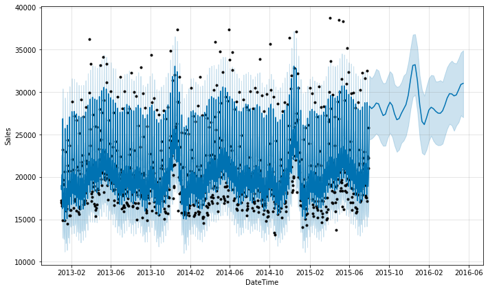
    


```python
fig2=model.plot_components(forecast)
```


    
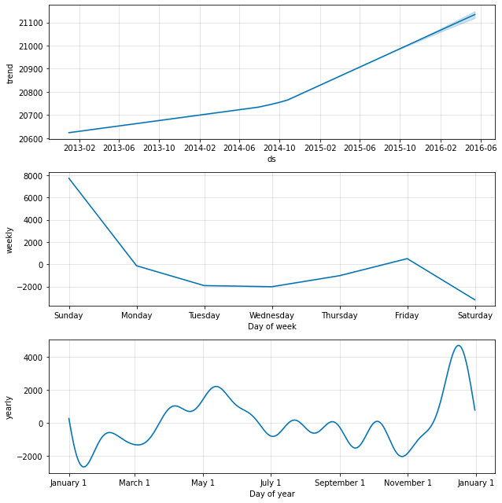
    


ın above, two figures shows the observed values of our sales price prediction (the black dots), the forecasted values (blue line) and the uncertainty intervals of our forecasts (the light blue shaded regions).

Prophet library provides to return the components of our forecasts.

This can help reveal how daily, weekly and yearly patterns of the time series contribute to the overall forecasted values.

# 7. Incorporating Holidays :calendar:

### Since we have holidays too in our dataset, we need to incorporate those days too as they affect the sales as well as forecasting.


```python
df.head()
```


<div>
<style scoped>
    .dataframe tbody tr th:only-of-type {
        vertical-align: middle;
    }

    .dataframe tbody tr th {
        vertical-align: top;
    }

    .dataframe thead th {
        text-align: right;
    }
</style>
<table border="1" class="dataframe">
  <thead>
    <tr style="text-align: right;">
      <th></th>
      <th>Store</th>
      <th>DayOfWeek</th>
      <th>Date</th>
      <th>Sales</th>
      <th>Customers</th>
      <th>Open</th>
      <th>Promo</th>
      <th>StateHoliday</th>
      <th>SchoolHoliday</th>
      <th>Year</th>
      <th>Month</th>
      <th>Day</th>
      <th>Weekday</th>
    </tr>
  </thead>
  <tbody>
    <tr>
      <th>0</th>
      <td>1</td>
      <td>5</td>
      <td>2015-07-31</td>
      <td>5263</td>
      <td>555</td>
      <td>1</td>
      <td>1</td>
      <td>0</td>
      <td>1</td>
      <td>2015</td>
      <td>7</td>
      <td>31</td>
      <td>Friday</td>
    </tr>
    <tr>
      <th>1</th>
      <td>2</td>
      <td>5</td>
      <td>2015-07-31</td>
      <td>6064</td>
      <td>625</td>
      <td>1</td>
      <td>1</td>
      <td>0</td>
      <td>1</td>
      <td>2015</td>
      <td>7</td>
      <td>31</td>
      <td>Friday</td>
    </tr>
    <tr>
      <th>2</th>
      <td>3</td>
      <td>5</td>
      <td>2015-07-31</td>
      <td>8314</td>
      <td>821</td>
      <td>1</td>
      <td>1</td>
      <td>0</td>
      <td>1</td>
      <td>2015</td>
      <td>7</td>
      <td>31</td>
      <td>Friday</td>
    </tr>
    <tr>
      <th>3</th>
      <td>4</td>
      <td>5</td>
      <td>2015-07-31</td>
      <td>13995</td>
      <td>1498</td>
      <td>1</td>
      <td>1</td>
      <td>0</td>
      <td>1</td>
      <td>2015</td>
      <td>7</td>
      <td>31</td>
      <td>Friday</td>
    </tr>
    <tr>
      <th>4</th>
      <td>5</td>
      <td>5</td>
      <td>2015-07-31</td>
      <td>4822</td>
      <td>559</td>
      <td>1</td>
      <td>1</td>
      <td>0</td>
      <td>1</td>
      <td>2015</td>
      <td>7</td>
      <td>31</td>
      <td>Friday</td>
    </tr>
  </tbody>
</table>
</div>


```python
df['SchoolHoliday'].unique()
```


    array([1, 0], dtype=int64)


```python
df['StateHoliday'].unique()
```


    array(['0', 'a', 'b', 'c', 0], dtype=object)


Creating another dataframe for holidays only with respect to the date


```python
# create holidays dataframe
#Three different holidays are avaiable in State Holiday
state_dates = df[(df.StateHoliday == 'a') | (df.StateHoliday == 'b') & (df.StateHoliday == 'c')].loc[:, 'Date'].values
school_dates = df[df.SchoolHoliday == 1].loc[:, 'Date'].values

state = pd.DataFrame({'holiday': 'state_holiday',
                      'ds': pd.to_datetime(state_dates)})
school = pd.DataFrame({'holiday': 'school_holiday',
                      'ds': pd.to_datetime(school_dates)})

holidays = pd.concat((state, school))
holidays.head(5)
```


<div>
<style scoped>
    .dataframe tbody tr th:only-of-type {
        vertical-align: middle;
    }

    .dataframe tbody tr th {
        vertical-align: top;
    }

    .dataframe thead th {
        text-align: right;
    }
</style>
<table border="1" class="dataframe">
  <thead>
    <tr style="text-align: right;">
      <th></th>
      <th>holiday</th>
      <th>ds</th>
    </tr>
  </thead>
  <tbody>
    <tr>
      <th>0</th>
      <td>state_holiday</td>
      <td>2015-06-04</td>
    </tr>
    <tr>
      <th>1</th>
      <td>state_holiday</td>
      <td>2015-06-04</td>
    </tr>
    <tr>
      <th>2</th>
      <td>state_holiday</td>
      <td>2015-06-04</td>
    </tr>
    <tr>
      <th>3</th>
      <td>state_holiday</td>
      <td>2015-06-04</td>
    </tr>
    <tr>
      <th>4</th>
      <td>state_holiday</td>
      <td>2015-06-04</td>
    </tr>
  </tbody>
</table>
</div>


#### Now as our holiday dataframe is ready consisting all state and school holidays combined, we can feed this data into the prophet model to make forecast accordingly.


```python
model = Prophet(interval_width = 0.95, holidays = holidays)
model.fit(prophet_df)
```

    12:25:48 - cmdstanpy - INFO - Chain [1] start processing
    12:25:48 - cmdstanpy - INFO - Chain [1] done processing
    


    <prophet.forecaster.Prophet at 0x2aad14139a0>


```python
# dataframe that extends into future 6 weeks
future_dates = model.make_future_dataframe(periods = 42, freq ='W')

print("First week to forecast.")
future_dates.head()
```

    First week to forecast.
    


<div>
<style scoped>
    .dataframe tbody tr th:only-of-type {
        vertical-align: middle;
    }

    .dataframe tbody tr th {
        vertical-align: top;
    }

    .dataframe thead th {
        text-align: right;
    }
</style>
<table border="1" class="dataframe">
  <thead>
    <tr style="text-align: right;">
      <th></th>
      <th>ds</th>
    </tr>
  </thead>
  <tbody>
    <tr>
      <th>0</th>
      <td>2013-01-01</td>
    </tr>
    <tr>
      <th>1</th>
      <td>2013-01-02</td>
    </tr>
    <tr>
      <th>2</th>
      <td>2013-01-03</td>
    </tr>
    <tr>
      <th>3</th>
      <td>2013-01-04</td>
    </tr>
    <tr>
      <th>4</th>
      <td>2013-01-05</td>
    </tr>
  </tbody>
</table>
</div>


```python
future_dates.shape
```


    (984, 1)


# 8. Final Forecast with Holidays :crystal_ball:

### As the future dates are created, we can now pass these dates to the trained model for performing predictions


```python
forecast = model.predict(future_dates)
forecast[['ds', 'yhat', 'yhat_lower', 'yhat_upper']].tail()
```


<div>
<style scoped>
    .dataframe tbody tr th:only-of-type {
        vertical-align: middle;
    }

    .dataframe tbody tr th {
        vertical-align: top;
    }

    .dataframe thead th {
        text-align: right;
    }
</style>
<table border="1" class="dataframe">
  <thead>
    <tr style="text-align: right;">
      <th></th>
      <th>ds</th>
      <th>yhat</th>
      <th>yhat_lower</th>
      <th>yhat_upper</th>
    </tr>
  </thead>
  <tbody>
    <tr>
      <th>979</th>
      <td>2016-04-17</td>
      <td>29521.613658</td>
      <td>24391.290553</td>
      <td>34670.873413</td>
    </tr>
    <tr>
      <th>980</th>
      <td>2016-04-24</td>
      <td>29522.727861</td>
      <td>24415.576511</td>
      <td>35280.547903</td>
    </tr>
    <tr>
      <th>981</th>
      <td>2016-05-01</td>
      <td>30077.945901</td>
      <td>24249.565096</td>
      <td>35350.374397</td>
    </tr>
    <tr>
      <th>982</th>
      <td>2016-05-08</td>
      <td>30685.694507</td>
      <td>25493.407885</td>
      <td>35853.648040</td>
    </tr>
    <tr>
      <th>983</th>
      <td>2016-05-15</td>
      <td>30712.329597</td>
      <td>25436.762167</td>
      <td>36241.465253</td>
    </tr>
  </tbody>
</table>
</div>


# 9. Plotting Final Forecast with Holidays :chart_with_upwards_trend:


```python
plt.figure(figsize = (15,5))
fig = model.plot(forecast,xlabel ='Date',ylabel= 'Sales',uncertainty = True)
```


    <Figure size 1080x360 with 0 Axes>


    
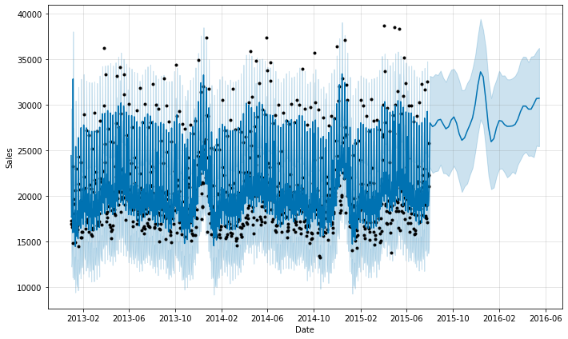
    


```python
fig2=model.plot_components(forecast)
```

# 10 Conclusion :tada:
### Congratulations! We have completed an awesome sales forecasting analysis using Prophet library. :sparkles: Feel free to use this repository as a reference for future projects and happy forecasting! :raised_hands:
